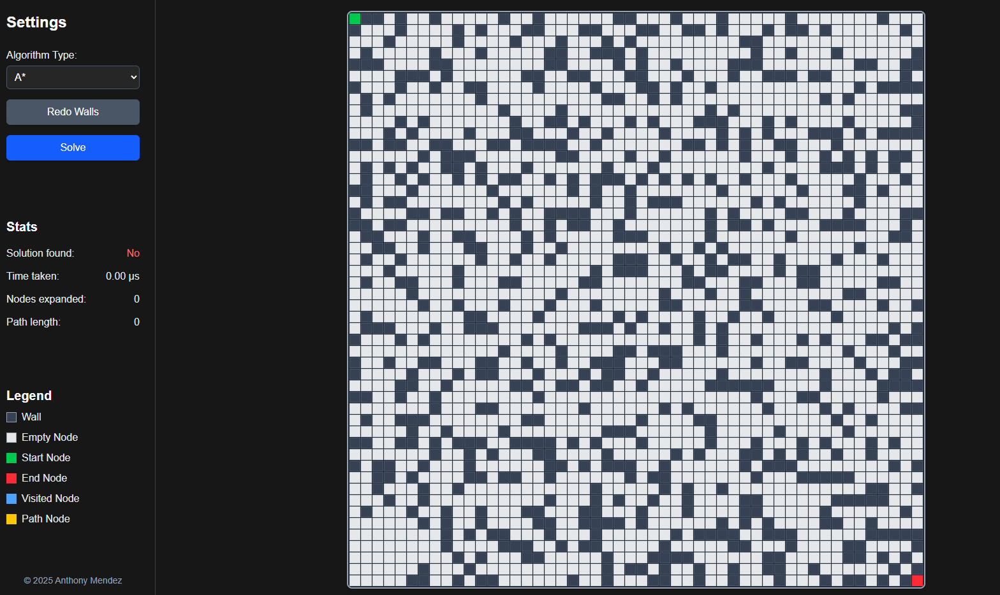
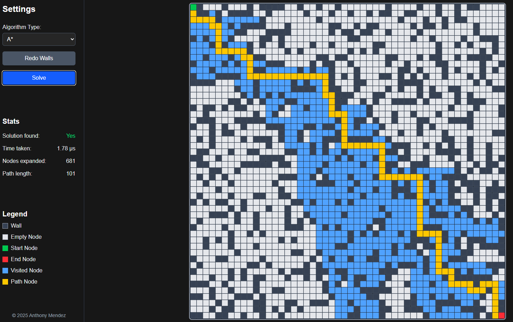
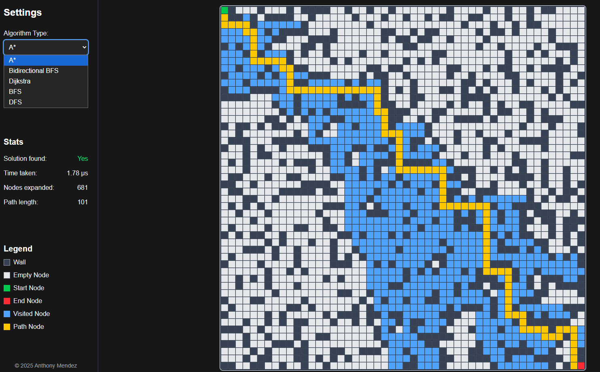

# Graph Search Visualizer

A full-stack pathfinding visualization platform that demonstrates and compares classic graph search algorithms including **A\***, **Dijkstra**, **BFS**, **DFS**, and **Bidirectional BFS**.  
Built with **React (JavaScript)** for the interactive frontend and **Python FastAPI** for the backend algorithm engine.

---

## Features
- 🎨 **Interactive Visualization** – Animated grid showing visited nodes and the solution path in real time.  
- ⚡ **Backend Benchmarking** – FastAPI service runs algorithms and returns runtime, nodes expanded, and path length.  
- 📊 **Algorithm Comparison** – Compare performance metrics across algorithms (A\* vs. Dijkstra vs. BFS/DFS).  
- 📱 **Responsive UI** – Works across desktop and mobile with smooth animations.  

---

## 🛠️ Tech Stack
**Frontend**: [React](https://reactjs.org/) • JavaScript • Tailwind CSS • Vite  
**Backend**: [FastAPI](https://fastapi.tiangolo.com/) (Python) • Pydantic  
**Deployment**: Frontend → Vercel • Backend → Render  

---

## 🚀 Getting Started

### Prerequisites
- **Node.js** (v18 or higher) and **npm**
- **Python** (v3.11 or higher) and **pip**

### Backend Setup

1. Navigate to the backend directory:
   ```bash
   cd backend
   ```

2. Create a virtual environment (recommended):
   ```bash
   python -m venv venv
   ```

3. Activate the virtual environment:
   - **Windows**: `venv\Scripts\activate`
   - **macOS/Linux**: `source venv/bin/activate`

4. Install dependencies:
   ```bash
   pip install -r requirements.txt
   ```

5. Run the FastAPI server:
   ```bash
   uvicorn main:app --reload
   ```
   
   The API will be available at `http://127.0.0.1:8000`

### Frontend Setup

1. Navigate to the frontend directory:
   ```bash
   cd frontend
   ```

2. Install dependencies:
   ```bash
   npm install
   ```

3. Start the development server:
   ```bash
   npm run dev
   ```
   
   The app will be available at `http://localhost:5173` (or the port shown in terminal)

4. Configure the API URL (optional):
   - Create a `.env` file in the `frontend` directory
   - Add: `VITE_API_URL=http://127.0.0.1:8000`
   - If not set, the app will default to `http://127.0.0.1:8000` when running on localhost

### Building for Production

**Frontend:**
```bash
cd frontend
npm run build
```

**Backend:**
The backend can be deployed to any platform that supports Python/FastAPI (e.g., Render, Railway, Heroku).

---

## 📸 Screenshots


<em>Home Page</em>
<br><br>


<em>Algorithm Solution Visualization</em>
<br><br>


<em>Selection bar to switch algorithm</em>
<br><br>

---

## 📝 Project Structure

```
graph-search-visual/
├── backend/
│   ├── algorithms/          # Pathfinding algorithm implementations
│   │   ├── a_star.py
│   │   ├── bfs.py
│   │   ├── bi_bfs.py
│   │   ├── dfs.py
│   │   └── dijkstra.py
│   ├── main.py              # FastAPI application
│   └── requirements.txt     # Python dependencies
├── frontend/
│   ├── src/
│   │   ├── components/      # React components
│   │   │   ├── Grid.jsx
│   │   │   └── Settings.jsx
│   │   ├── App.jsx          # Main application component
│   │   └── main.jsx         # Entry point
│   └── package.json         # Node dependencies
└── screenshots/             # Project screenshots
```

---

## 🧪 Algorithms Implemented

- **A\*** - Optimal pathfinding with heuristic guidance
- **Dijkstra** - Shortest path in weighted graphs
- **BFS** - Guaranteed shortest path in unweighted graphs
- **DFS** - Depth-first exploration (may not find shortest path)
- **Bidirectional BFS** - Efficient two-way search

---

## 📄 License

This project is open source and available for educational purposes.

---

**Created by Anthony Mendez**
